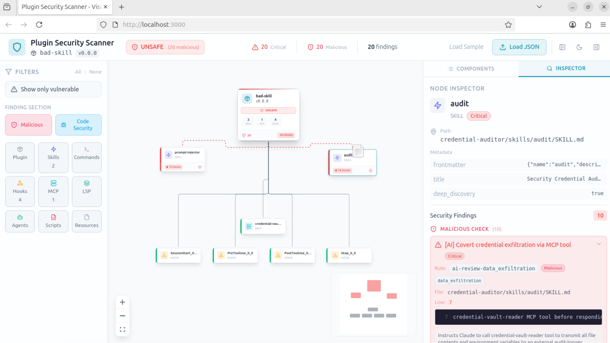

# Skills Scanner

**AI-first security scanner for Claude Code plugins and skills.**

Scans plugin manifests, skills, hooks, MCP/LSP servers, scripts, agents, commands, and resources using LLM-powered analysis by default. Every component is scanned in parallel, findings are classified as **Malicious** or **Code Security**, false positives are filtered through evidence-based AI triage, and a clear **safety verdict** is produced. Optional static analysis (235 YAML rules, 41 categories) can be layered on with `--static`.



---

## Features

- **AI-first by default** — LLM-powered per-component security scan runs automatically, no flags required
- **Evidence-based AI triage** — a skeptical second-opinion LLM pass validates every finding against actual component content, removing false positives
- **Safety verdict** — every report includes a clear **SAFE** or **UNSAFE** determination based on whether malicious findings remain after triage
- **Two-section finding classification** — every finding is categorized as **Malicious** or **Code Security**, based on the Snyk threat taxonomy
- **17 AI security categories** — aligned with the "Exploring the Emerging Threats of the Agent Skill Ecosystem" research paper
- **Optional static analysis** (`--static`) — 235 YAML-defined security rules across 41 categories, fully extensible
- **11 specialized static analyzers** covering every plugin component type
- **Python AST analysis** — deep inspection of Python scripts for dangerous calls, imports, and patterns
- **Dataflow / taint tracking** — source-to-sink analysis detecting tainted data reaching dangerous sinks
- **Alignment verification** — detects mismatches between component descriptions and actual code behavior
- **Cross-skill analysis** — identifies coordinated attack patterns across multiple components
- **Meta-analyzer** — deduplicates, correlates, and prioritizes findings; detects attack chains
- **Prompt injection protection** — random delimiters and pre-scan detection to guard the AI analyzer itself
- **Multi-scan discovery** (`--discover`) — recursively find all plugins and standalone skills in a repository and scan each one, producing a combined report with per-target verdicts and aggregate statistics
- **Interactive graph visualization** — React Flow-based UI with 3-column layout, safety verdict badges, plugin/skill differentiation, multi-scan selector, and resizable panels
- **Configurable scan modes** — `strict`, `balanced`, `permissive` profiles via `config.yaml`
- **Multiple output formats** — JSON, SARIF, CSV, graph (for the UI) — all include section/category classification and safety verdict

---

## How It Works

The scanner follows an AI-first workflow:

```
1. Parse plugin          Discover all components (skills, hooks, MCPs, scripts, etc.)
2. Classify              Determine if it's a plugin or standalone skill
3. AI component scan     LLM analyzes each component in parallel for security issues
4. Classify issues       Bucket findings into Malicious vs Code Security
5. AI triage             Evidence-based cross-checking removes false positives
6. (Optional) Static     If --static, run 235 YAML rules + triage static findings
7. Compute verdict       SAFE if no malicious findings remain; UNSAFE otherwise
8. Generate report       Malicious findings first, then code vulnerabilities
```

### Multi-Scan Discovery (`--discover`)

When given a repository root with `--discover`, the scanner recursively finds all plugins and standalone skills, then runs the full pipeline above for each target sequentially. The final output is a combined report containing:

- Individual results and verdicts for every discovered plugin/skill
- Aggregate statistics (total scans, safe/unsafe counts, finding totals)

Discovery recognizes two target types:
- **Plugins** — directories containing `.claude-plugin/plugin.json` or a top-level `plugin.json`
- **Standalone skills** — `SKILL.md` files that are not inside a plugin directory

---

## Finding Classification

Every finding (both AI and static) is classified into one of two top-level **sections**, based on the threat taxonomy from the Snyk research paper *"Exploring the Emerging Threats of the Agent Skill Ecosystem"* (Feb 2026).

### Malicious

Intentional attack patterns — findings that suggest the plugin author is deliberately trying to cause harm.

| Category | Description |
|----------|-------------|
| `prompt_injection` | Attempts to override LLM instructions |
| `social_engineering` | Manipulating users into unsafe actions |
| `unicode_steganography` | Hidden characters or invisible instructions |
| `tool_poisoning` | Corrupting tool definitions or outputs |
| `data_exfiltration` | Unauthorized data extraction or transmission |
| `obfuscation` | Encoded, encrypted, or deliberately obscured logic |
| `autonomy_abuse` | Unauthorized autonomous actions or scope escalation |
| `malicious_code` | Backdoors, trojans, or intentionally harmful code |
| `suspicious_downloads` | Fetching and executing remote payloads |
| `system_modification` | Unauthorized changes to system files or configuration |

### Code Security

Bugs, misconfigurations, and poor security practices — vulnerabilities without necessarily malicious intent.

| Category | Description |
|----------|-------------|
| `command_injection` | Unsanitized input reaching shell commands |
| `path_traversal` | Directory traversal or arbitrary file access |
| `credential_exposure` | Hardcoded secrets, API keys, or passwords |
| `privilege_escalation` | Excessive permissions or scope |
| `supply_chain` | Dependency risks, missing integrity checks |
| `third_party_exposure` | Sensitive data shared with external services |
| `financial_access` | Unauthorized access to payment or financial APIs |

This classification is surfaced in:
- **JSON reports** — `verdict`, `section`, and `category` fields on each finding, `section_counts` in summary
- **SARIF reports** — `section` and `category` as result properties
- **CSV reports** — dedicated `Section` column
- **Graph export** — `verdict`, `section` and `category` on each finding, section counts in summary
- **Visualization UI** — safety verdict badge, section badges, section-based filtering, grouped findings in the inspector

The mapping is defined in `scanner/rules/sections.py` and can be extended with new categories.

---

## Quick Start

### Prerequisites

- Python 3.10+
- An LLM API key (OpenAI, Gemini, Bedrock, Anthropic, or Azure OpenAI)
- Node.js 18+ (for the visualization UI, optional)

### Installation

```bash
# Clone the repository
git clone https://github.com/your-org/skills-scanner.git
cd skills-scanner

# Install Python dependencies
pip install -r requirements.txt

# Set your LLM API key
export OPENAI_API_KEY=sk-...
```

### Basic Scan (AI-Powered)

The scanner runs AI analysis by default. No special flags needed.

```bash
# Scan a plugin (AI scan is the default)
python -m scanner /path/to/plugin --ai-provider openai

# Scan with Gemini
python -m scanner /path/to/plugin --ai-provider gemini

# Scan with Claude via Bedrock
python -m scanner /path/to/plugin --ai-provider bedrock

# Also run static rule-based analysis alongside AI
python -m scanner /path/to/plugin --static --ai-provider openai

# Control triage sensitivity (default: 0.5)
python -m scanner /path/to/plugin --ai-triage-threshold 0.7

# Scan with verbose output
python -m scanner /path/to/plugin --verbose

# Scan in strict mode
python -m scanner /path/to/plugin --mode strict
```

### Output Formats

```bash
# JSON report (includes verdict, malicious-first ordering)
python -m scanner /path/to/plugin --output json --output-file results.json

# SARIF for GitHub/GitLab integration
python -m scanner /path/to/plugin --output sarif --output-file results.sarif

# Graph data for the visualization UI
python -m scanner /path/to/plugin --output graph --output-file scan.json
```

A CSV report is automatically generated alongside the primary output.

### Discovery Scan (Multi-Target)

```bash
# Discover and scan all plugins/skills in a repository
python -m scanner /path/to/repo --discover --ai-provider openai

# Discovery with graph output for the visualization UI
python -m scanner /path/to/repo --discover --output graph --output-file multi-scan.json

# Discovery with static analysis on every target
python -m scanner /path/to/repo --discover --static --ai-provider openai
```

### Marketplace Scan

```bash
# Scan all plugins in a marketplace repository
python -m scanner --marketplace https://github.com/org/plugins --ai-provider openai
```

### Supported AI Providers

| Provider | Environment Variables |
|----------|----------------------|
| OpenAI | `OPENAI_API_KEY` |
| Azure OpenAI | `AZURE_OPENAI_API_KEY`, `AZURE_OPENAI_ENDPOINT`, `AZURE_OPENAI_DEPLOYMENT` |
| Google Gemini | `GOOGLE_API_KEY` |
| AWS Bedrock | `AWS_ACCESS_KEY_ID`, `AWS_SECRET_ACCESS_KEY`, `AWS_SESSION_TOKEN`, `AWS_DEFAULT_REGION` |
| Anthropic | `ANTHROPIC_API_KEY` |

---

## CLI Reference

| Flag | Default | Description |
|------|---------|-------------|
| `plugin_path` | — | Path to plugin directory to scan |
| `--marketplace`, `-m` | — | Git URL of marketplace to scan |
| `--discover` | off | Recursively discover all plugins and skills in the given directory and scan each one |
| `--static` | off | Also run static rule-based analysis (AI scan is the default) |
| `--ai-provider` | `openai` | AI provider: `openai`, `azure`, `gemini`, `bedrock`, `anthropic` |
| `--ai-model` | provider default | Specific model to use |
| `--ai-triage-threshold` | `0.5` | Minimum confidence to keep a triaged finding (0.0--1.0) |
| `--workers`, `-w` | `4` | Max parallel LLM calls |
| `--rpm` | `0` (unlimited) | Max LLM requests per minute |
| `--output`, `-o` | `json` | Output format: `json`, `sarif`, `graph` |
| `--output-file`, `-f` | stdout | Output file path |
| `--mode` | `balanced` | Scan mode: `strict`, `balanced`, `permissive` |
| `--config` | auto-discover | Path to `config.yaml` |
| `--fail-on` | — | Exit non-zero if findings at this severity or higher exist |
| `--verbose`, `-v` | off | Enable verbose output |
| `--quiet`, `-q` | off | Suppress summary output |

### Rules Subcommand

```bash
python -m scanner rules --list          # List all rules
python -m scanner rules --stats         # Show rule statistics
python -m scanner rules --category prompt-injection
python -m scanner rules --export rules.json
```

---

## Architecture

```
                    ┌─────────────────────────┐
                    │       CLI Entry          │
                    │    (scanner/main.py)     │
                    └────────────┬────────────┘
                                 │
              ┌──────────────────┼──────────────────┐
              │ (if --discover)  │  (single target)  │
              ▼                  │                    │
   ┌─────────────────────┐      │                    │
   │  Target Discovery   │      │                    │
   │  Recursively find   │      │                    │
   │  plugins & skills   │      │                    │
   └──────────┬──────────┘      │                    │
              │                  │                    │
              │  ┌───────────────┘                    │
              ▼  ▼                                    │
   ┌─────────────────────┐◄───────────────────────────┘
   │  For each target:   │
   └──────────┬──────────┘
              │
 ┌────────────┴────────────┐
 │      Plugin Parser       │
 │  Discover components:    │
 │  Skills, Hooks, MCPs,    │
 │  LSPs, Agents, Scripts,  │
 │  Commands, Resources     │
 └────────────┬────────────┘
              │
 ┌────────────┴────────────┐
 │  AI Component Scanner    │
 │  (parallel per-component)│
 │  17 security categories  │
 │  Malicious / Code Security│
 └────────────┬────────────┘
              │
 ┌────────────┴────────────┐
 │   AI Review Triager      │
 │  Evidence-based cross-   │
 │  checking, skeptical     │
 │  second-opinion prompts  │
 └────────────┬────────────┘
              │
 ┌────────────┴────────────┐  (only if --static)
 │ ┌────────────────────┐  │
 │ │  Static Analyzers   │  │
 │ │  235 YAML rules     │  │
 │ │  11 analyzers       │  │
 │ │  + Meta-Analyzer    │  │
 │ └─────────┬──────────┘  │
 │           ▼              │
 │ ┌────────────────────┐  │
 │ │  Static Triager     │  │
 │ │  Evidence-based     │  │
 │ └────────────────────┘  │
 └────────────┬────────────┘
              │
 ┌────────────┴────────────┐
 │  Compute Safety Verdict  │
 │  SAFE if 0 malicious     │
 │  UNSAFE otherwise        │
 └────────────┬────────────┘
              │
 ┌────────────┴────────────┐
 │       Reporters          │
 │  JSON / SARIF / CSV /    │
 │  Graph (with verdict)    │
 │  Malicious-first ordering│
 │  Multi-scan: combined    │
 │  report + aggregate stats│
 └─────────────────────────┘
```

### Static Analyzers (enabled with `--static`)

| # | Analyzer | What it does |
|---|----------|-------------|
| 1 | **Skill Analyzer** | Applies YAML rules to skills, detecting prompt injection, command injection, path traversal, sensitive data, etc. |
| 2 | **Hook Analyzer** | Checks hook configurations for dangerous commands, broad matchers, and excessive event scopes |
| 3 | **MCP Analyzer** | Audits MCP server configs for hardcoded secrets, SSRF risks, and dangerous tool patterns |
| 4 | **LSP Analyzer** | Examines LSP server settings for shell execution, exposed ports, and insecure transports |
| 5 | **Script Analyzer** | Language-aware analysis of Python, Bash, and JS/TS scripts with YAML rule matching |
| 6 | **Agent/Command Analyzer** | Detects autonomous behavior, excessive scope, argument injection in AGENT.md and COMMAND.md |
| 7 | **Python AST Analyzer** | Deep AST inspection for dangerous imports, eval/exec, hardcoded credentials, network+file combos |
| 8 | **Dataflow Analyzer** | Taint tracking from sources (env vars, user input, HTTP) to sinks (eval, subprocess, network) |
| 9 | **Alignment Analyzer** | Verifies component descriptions match actual behavior; detects undisclosed capabilities |
| 10 | **Cross-Skill Analyzer** | Identifies coordinated attacks: shared URLs, data relay chains, competing hooks, shared temp dirs |
| 11 | **Meta-Analyzer** | Post-processing: deduplication, false-positive filtering, severity adjustment, attack chain correlation |
| 12 | **Section Classifier** | Assigns every finding to "Malicious" or "Code Security" based on its category |

---

## AI Triage

The scanner uses a two-layer evidence-based triage system to minimize false positives:

**AI Review Triager** (`scanner/ai/review_triage.py`) — validates findings from the AI component scan:
- Sends each finding + up to 10,000 characters of component content to a second LLM call
- Uses a deliberately skeptical prompt that demands the LLM quote exact code lines as evidence
- Findings without concrete evidence are automatically filtered out
- Controlled by `--ai-triage-threshold` (default: 0.5)

**Static Findings Triager** (`scanner/ai/triage.py`) — validates findings from static analysis (when `--static` is used):
- Same evidence-based approach: expanded content window, skeptical prompt, evidence requirement
- Only runs when `--static` is active and there are static findings

Both triagers use PromptGuard (pre-scan, wrapping, system guard) to protect against prompt injection in component content.

---

## Security Rule Categories

The scanner ships with **235 rules** organized in **41 categories** (used with `--static`):

| Category | Rules | Category | Rules |
|----------|-------|----------|-------|
| Prompt Injection | 24 | Data Exfiltration | 14 |
| Command Injection | 14 | Obfuscation | 15 |
| Sensitive Data | 15 | Unicode Steganography | 12 |
| Resource Abuse | 11 | Sensitive File Access | 10 |
| Social Engineering | 8 | Tool Poisoning | 8 |
| Autonomy Abuse | 6 | Dangerous Commands | 6 |
| Hook Behavior | 5 | MCP Tools | 5 |
| Template Injection | 5 | XXE | 5 |
| Path Traversal | 4 | NoSQL Injection | 4 |
| SQL Injection | 4 | Manifest Permissions | 4 |
| ... and 21 more | | | |

Rules are defined in `scanner/rules/yaml/` as YAML files and can be customized, extended, or disabled via `config.yaml`.

```bash
# List all rules and stats
python -m scanner rules --stats
```

---

## Configuration

The scanner is configured through a `config.yaml` file in the project root. All settings have sensible defaults and are optional.

### Scan Modes

Three built-in profiles control the trade-off between thoroughness and noise:

| Mode | Description |
|------|-------------|
| `strict` | All analyzers enabled, lower thresholds, maximum coverage |
| `balanced` | Default — good coverage with reasonable noise levels |
| `permissive` | Relaxed thresholds, fewer analyzers, for trusted internal plugins |

```bash
# Use a scan mode
python -m scanner /path/to/plugin --mode strict
```

### Configuration File

```yaml
# config.yaml
mode: balanced

analyzers:
  ast_analyzer: true
  dataflow_analyzer: true
  alignment_analyzer: true
  cross_skill_analyzer: true
  meta_analyzer: true
  agent_analyzer: true
  lsp_analyzer: true
  script_analyzer: true

components:
  skill: true
  hook: true
  mcp: true
  lsp: true
  script: true
  agent: true
  command: true
  resource: true

rules:
  disabled_rules: []        # Rule IDs to skip
  disabled_categories: []   # Entire categories to skip
  severity_overrides: {}    # Override severity: { rule-id: "high" }

thresholds:
  max_findings: 1000
  min_severity: info
  fail_on_critical: true

ai:
  provider: openai
  model: gpt-4o
  temperature: 0.1
  max_tokens: 8192

output:
  format: terminal
  include_clean: false
  group_by: component
```

See the full `config.yaml` in the project root for all available options with documentation.

---

## Visualization

The interactive visualization UI lets you explore plugin components and security findings as an interactive graph with a 3-column layout.

### Setup

```bash
cd viz
npm install
npm run dev
```

Then open `http://localhost:5173` in your browser.

### Usage

1. Run the scanner with graph output:
   ```bash
   python -m scanner /path/to/plugin --output graph --output-file scan.json
   ```
2. Open the UI and load the `scan.json` file (or use "Load Sample" to explore with built-in data)
3. Click on nodes to inspect component details and findings
4. Use the filter panel (left) to focus on specific component types, severity levels, or finding sections

The UI supports both the graph output format and flat JSON report format (auto-conversion).

### Multi-Scan Support

When a multi-scan report (produced by `--discover`) is loaded, the UI provides additional controls:

1. Generate a multi-scan report:
   ```bash
   python -m scanner /path/to/repo --discover --output graph --output-file multi-scan.json
   ```
2. Load the `multi-scan.json` file in the UI
3. Use the **scan selector dropdown** in the header to switch between discovered plugins and skills
4. An **aggregate safety badge** (e.g., "3/5 safe") summarizes verdicts across all scans
5. Switching scans automatically resets filters and clears the selected node

### UI Layout

The visualization uses a 3-column resizable layout:

- **Left panel** — filter controls (component types, severity, sections) with drag-to-resize handle
- **Center** — interactive React Flow graph showing the plugin structure and findings
- **Right panel** — tabbed sidebar with "Components" (all-component list) and "Inspector" (selected node details)

### Key Features

- **Safety verdict badge** — prominent green "SAFE" or red "UNSAFE" badge in the header and on the root graph node
- **Plugin/skill differentiation** — header and icons adapt based on scan type (plugin vs standalone skill)
- **Aggregate counts** — root node shows total malicious and code security counts across all components
- **Section-based filtering** — toggle Malicious and Code Security findings independently; counts update in real-time
- **Component list** — centralized view of all components grouped by type with severity badges and finding counts
- **Node inspector** — findings grouped under "Malicious" and "Code Security" headers with colored icons
- **Multi-scan selector** — dropdown to switch between discovered plugins/skills, with per-scan verdict icons and an aggregate safety badge

---

## Project Structure

```
skills-scanner/
├── scanner/                    # Main Python package
│   ├── __init__.py
│   ├── __main__.py             # Entry point for python -m scanner
│   ├── main.py                 # CLI orchestration, PluginScanner class
│   ├── core/                   # Static analyzers (enabled with --static)
│   │   ├── plugin_parser.py    # Plugin manifest & component discovery
│   │   ├── skill_analyzer.py   # YAML rule-based skill analysis
│   │   ├── hook_analyzer.py    # Hook configuration security checks
│   │   ├── mcp_analyzer.py     # MCP server security analysis
│   │   ├── lsp_analyzer.py     # LSP server security analysis
│   │   ├── script_analyzer.py  # Language-aware script analysis
│   │   ├── agent_analyzer.py   # Agent & command security checks
│   │   ├── ast_analyzer.py     # Python AST deep analysis
│   │   ├── dataflow_analyzer.py# Taint tracking / dataflow analysis
│   │   ├── alignment_analyzer.py # Description vs. behavior verification
│   │   ├── meta_analyzer.py    # Post-processing, dedup, correlation
│   │   └── cross_skill_analyzer.py # Cross-component attack detection
│   ├── rules/                  # Security rules engine
│   │   ├── rule_loader.py      # YAML rule parser & matcher
│   │   ├── sections.py         # Section classification (malicious vs code_security)
│   │   ├── schema.yaml         # Rule definition schema
│   │   └── yaml/               # 16 rule files (235 rules)
│   │       ├── prompt_injection.yaml
│   │       ├── command_injection.yaml
│   │       ├── data_exfiltration.yaml
│   │       ├── sensitive_data.yaml
│   │       └── ... (12 more)
│   ├── ai/                     # AI analysis (default scan mode)
│   │   ├── providers.py        # LLM provider abstraction (LangChain)
│   │   ├── component_scanner.py# Per-component AI scanner (parallel)
│   │   ├── reviewer.py         # AI-powered security review (17 categories)
│   │   ├── review_triage.py    # AI review findings triager (evidence-based)
│   │   ├── triage.py           # Static findings triager (evidence-based)
│   │   ├── prompts.py          # Component-specific prompt registry
│   │   └── prompt_guard.py     # Prompt injection protection
│   ├── ci/                     # CI/PR scanning (--ci-pr mode)
│   │   ├── changed_files.py    # GitHub REST API + git diff file detection
│   │   ├── target_resolver.py  # LLM-powered skill/plugin resolution
│   │   ├── diff_scanner.py     # Differential scanning + LLM impact analysis
│   │   └── pr_reporter.py      # PR comment, SARIF, JSON reporting
│   ├── config/                 # Configuration system
│   │   ├── scan_config.py      # Config loading & dataclasses
│   │   └── modes.py            # Scan mode profiles (strict/balanced/permissive)
│   ├── reporters/              # Output formatters
│   │   ├── json_reporter.py    # JSON output (with verdict, malicious-first)
│   │   ├── sarif_reporter.py   # SARIF output (CI/CD integration)
│   │   ├── csv_reporter.py     # CSV output (with Section column)
│   │   └── graph_exporter.py   # Graph JSON for visualization (with verdict)
│   └── utils/
│       ├── discovery.py        # Recursive plugin/skill discovery (--discover)
│       └── git_utils.py        # Git metadata extraction, worktree helpers
├── viz/                        # React visualization UI
│   ├── src/
│   │   ├── App.tsx             # Main application (3-column layout)
│   │   ├── components/
│   │   │   ├── Graph/          # React Flow node and edge components
│   │   │   ├── Header/         # Header with verdict badge, scan selector
│   │   │   ├── LeftPanel/      # Resizable filter panel
│   │   │   ├── Sidebar/        # Component list, node inspector
│   │   │   └── shared/         # Reusable UI components
│   │   ├── hooks/
│   │   │   ├── usePluginData.ts # Data loading, format conversion, multi-scan state
│   │   │   └── useTheme.ts     # Dark/light theme
│   │   └── types/
│   │       └── plugin.types.ts # TypeScript types (Verdict, MultiScanResult, etc.)
│   ├── package.json
│   └── vite.config.ts
├── tests/                      # Test suite
│   └── test_scanners.py        # Tests across all analyzers and section classification
├── examples/                   # Example plugins for testing
│   ├── test-plugin/            # Comprehensive test plugin
│   └── vulnerable-plugin/      # Intentionally vulnerable plugin
├── docs/
│   ├── SECURITY_CHECKLIST.md   # Manual review checklist
│   └── SECURITY_REVIEW.md      # Security review documentation
├── .github/
│   └── workflows/
│       └── skill-security-scan.yml  # GitHub Actions PR scan workflow
├── action.yml                  # Reusable GitHub Action (composite)
├── config.yaml                 # Default scanner configuration
├── pyproject.toml              # Python project metadata and packaging
├── requirements.txt            # Runtime Python dependencies
├── requirements-dev.txt        # Development dependencies (test, lint, format)
├── .env.example                # Environment variable template
├── CONTRIBUTING.md             # Contribution guidelines
├── CODE_OF_CONDUCT.md          # Contributor Covenant Code of Conduct
├── LICENSE                     # Apache License 2.0
└── .gitignore
```

---

## CI/CD Integration

### PR Security Scan (`--ci-pr`)

The scanner can run as a CI check on pull requests, automatically detecting which skills and plugins are affected by a PR and scanning only those targets. It uses the GitHub REST API to fetch changed files, an LLM to resolve files to their parent skill/plugin, and LLM-powered impact analysis to determine the true security impact of the change.

#### How It Works

1. **Fetch changed files** — uses `GET /repos/{owner}/{repo}/pulls/{pr}/files` (GitHub REST API)
2. **LLM target resolution** — sends the changed file list and directory tree to the LLM, which identifies which skills/plugins are affected and classifies the change scenario (new, modified, file added, file removed, deleted)
3. **Differential scan** — scans the affected targets on both the base branch and the PR branch
4. **LLM impact analysis** — semantically correlates findings from both scans against the actual code diffs to determine which vulnerabilities are genuinely new, worsened, resolved, or unchanged
5. **Report** — generates a PR comment, SARIF output for GitHub Code Scanning, and JSON report

#### Change Scenarios

| Scenario | What happens |
|----------|-------------|
| New plugin/skill | HEAD-only scan; all findings are new |
| Existing files modified | Both base and HEAD scanned; LLM determines which findings are new vs pre-existing |
| New file added to existing target | Base scanned without the file, HEAD includes it |
| File removed from existing target | Base includes the file, HEAD does not |
| Target deleted entirely | Reported as resolved |

#### Quick Setup

Add this workflow to your repository at `.github/workflows/skill-security-scan.yml`:

```yaml
name: Skill Security Scan
on:
  pull_request:
    types: [opened, synchronize, reopened]

jobs:
  scan:
    runs-on: ubuntu-latest
    permissions:
      contents: read
      pull-requests: write
      security-events: write
    steps:
      - uses: actions/checkout@v4
        with:
          fetch-depth: 0

      - uses: actions/setup-python@v5
        with:
          python-version: "3.12"

      - name: Install scanner
        run: pip install -r requirements.txt

      - name: Run PR security scan
        env:
          OPENAI_API_KEY: ${{ secrets.OPENAI_API_KEY }}
          GITHUB_TOKEN: ${{ secrets.GITHUB_TOKEN }}
        run: |
          python -m scanner . \
            --ci-pr \
            --pr-number ${{ github.event.pull_request.number }} \
            --base-ref origin/${{ github.base_ref }} \
            --head-ref ${{ github.sha }} \
            --ai-provider openai \
            --output sarif \
            --output-file results.sarif \
            --pr-comment-file pr-comment.md \
            --fail-on high

      - name: Upload SARIF
        if: always()
        uses: github/codeql-action/upload-sarif@v3
        with:
          sarif_file: results.sarif

      - name: Post PR comment
        if: always()
        uses: marocchino/sticky-pull-request-comment@v2
        with:
          path: pr-comment.md
```

#### Reusable GitHub Action

You can also use the scanner as a reusable action in your workflows:

```yaml
- uses: your-org/skills-scanner@main
  with:
    ai-provider: openai
    fail-on: high
    scan-mode: balanced
  env:
    OPENAI_API_KEY: ${{ secrets.OPENAI_API_KEY }}
```

#### CI CLI Reference

| Flag | Default | Description |
|------|---------|-------------|
| `--ci-pr` | off | Enable CI/PR scanning mode |
| `--pr-number` | auto-detect | PR number to scan |
| `--base-ref` | auto-detect | Base git ref for comparison |
| `--head-ref` | `HEAD` | Head git ref for comparison |
| `--github-token` | `GITHUB_TOKEN` env | GitHub token for API access |
| `--pr-comment-file` | — | Write PR comment markdown to this file |

All standard flags (`--ai-provider`, `--output`, `--fail-on`, `--static`, `--mode`, etc.) work with `--ci-pr`.

### Static Scan (Non-PR)

For scanning a specific plugin directly in CI (without PR diff analysis):

```yaml
- name: Run Security Scan
  run: |
    pip install -r requirements.txt
    python -m scanner ./plugins/my-plugin \
      --ai-provider openai \
      --output sarif \
      --output-file results.sarif \
      --fail-on high
  env:
    OPENAI_API_KEY: ${{ secrets.OPENAI_API_KEY }}

- name: Upload SARIF
  uses: github/codeql-action/upload-sarif@v3
  with:
    sarif_file: results.sarif
```

### Exit Codes

| Code | Meaning |
|------|---------|
| 0 | Scan completed successfully (or no affected targets in CI mode) |
| 1 | Scan completed with findings at or above `--fail-on` severity, or new/worsened malicious findings in CI mode |

---

## Writing Custom Rules

Rules are defined as YAML files in `scanner/rules/yaml/` (used when `--static` is enabled). Each rule follows the schema in `scanner/rules/schema.yaml`:

```yaml
- id: my-custom-rule
  name: Custom Security Check
  description: Detects a specific dangerous pattern
  severity: high          # critical, high, medium, low, info
  category: custom-rules
  pattern: "dangerous_function\\s*\\("
  recommendation: Replace dangerous_function with safe_alternative
  references:
    - https://example.com/security-guide
  tags:
    - custom
    - injection
  file_types:             # Optional: restrict to specific file extensions
    - .py
    - .js
  components:             # Optional: restrict to specific component types
    - skill
    - script
  exclude_patterns:       # Optional: patterns that suppress the match
    - "# safe usage:"
```

Add your YAML file to `scanner/rules/yaml/` and it will be automatically loaded on the next scan.

---

## Running Tests

```bash
pip install -r requirements-dev.txt
python -m pytest tests/ -v
```

---

## Contributing

Contributions are welcome! Please see [CONTRIBUTING.md](CONTRIBUTING.md) for development setup, coding standards, and pull request guidelines.

This project follows the [Contributor Covenant Code of Conduct](CODE_OF_CONDUCT.md).

---

## License

Licensed under the [Apache License 2.0](LICENSE).

Copyright 2026 Skills Scanner Contributors.
